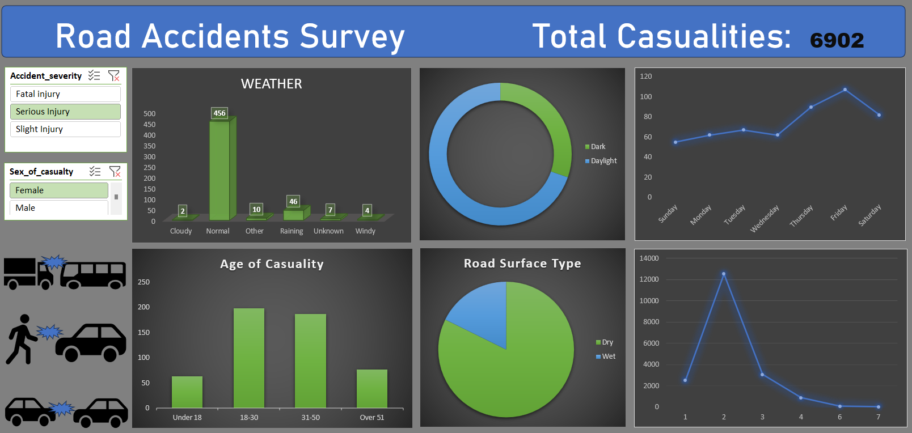

# Road Traffic Accidents Analysis

## Table Of Contents

- [Project Overview](#project-overview)
- [Data Sources](#data-sources)
- [Tools](#tools)
- [Data Cleaning/Preparation](#data-cleaningpreparation)
- [Data Analysis](#data-analysis)
- [Data Visualization](#data-visualization)
- [Analysis Insights](#analysis-insights)
- [Documentation](#documentation)
- [Limitations](#limitations)
- [References](#references)

### Project Overview

This project involved analyzing road traffic accident data using Excel to uncover patterns and trends that impact road safety. The analysis focused on various factors contributing to casualty rates and accident severity, providing insights that can inform preventive measures and improve traffic management. By examining the data from multiple perspectives, the project aimed to highlight critical areas for intervention to reduce road traffic accidents and enhance public safety.

### Data Sources

The road traffic accidents dataset was sourced from "Kaggle", providing a comprehensive collection of accident records that allowed for in-depth analysis and insights. [Download Dataset](https://www.kaggle.com/code/mohamedfaisvk/road-traffic-accidents-severity-classifier/input)

### Tools

- Microsoft Excel - Data Cleaning, Data Analysis
  - [Download Excel](https://www.microsoft.com/en-in/microsoft-365/excel)

### Data Cleaning/Preparation

In the Initial Data Preparation Phase, following tasks were performed:
1. Data Loading and Inspection
2. Handling Missing/Duplicate Values/Incorrect Values
3. Data Cleaning and formatting
   - A separate worksheet was created with 12 key columns selected from the original 32.
   - The purpose was to streamline the analysis and reduce file size.
   - Only necessary columns were chosen to focus on relevant insights.
   - As this was a personal project, the decision to use specific columns was made to simplify the process.
   - The full dataset with all original columns is available if needed.

### Data Analysis

"Pivot tables" and "Pivot charts" in Excel were used to analyze the road traffic accident data. These tools enabled quick identification of key patterns and insights, such as trends in casualties and factors influencing accidents.
- Analysis Focus Areas:
   - Total casualties   
   - Daytime effects
   - Age of casualties
   - Weather conditions
   - Road surface conditions
   - Casualties distribution by weekdays
   - Number of vehicles involved with casualties

### Data Visualization

An interactive dashboard was created in Excel to provide a quick summary of all the insights discovered during the analysis, allowing for easy exploration and interpretation of key findings.

### Analysis Insights

1. Total Casualties:
   - Identified trends and patterns in the overall number of casualties: 6,902.
     
2. Casualties Distribution by Weekdays:
   - Higher incidents noted on weekends.
     
3. Number of Vehicles Involved:
   - Analyzed the relationship between vehicle count and casualty severity:
   - Most accidents occurred with 2 vehicles involved.

4. Age of Casualties:
   - Most affected age group: 31-50 years.

5. Road Surface Conditions:
   - High accident rates observed on dry roads.

6. Weather Conditions:
   - Most accidents occurred under normal weather conditions, particularly involving females.

7. Daytime Effects:
   - The majority of accidents occurred during daylight hours.

### Documentation

Check out the uploaded PDF for a visual representation of my project: [Here](https://github.com/sumanju333/Road-Traffic-Accidents-Analysis/blob/main/Road%20Traffic%20Analysis.pdf)

### Limitations

The project is a very simple introduction to data analysis, focusing on basic insights derived from the data using pivot tables. It does not explore complex analytical techniques, limiting the depth of the findings. The results are presented in a straightforward dashboard format, suitable for beginners but not for advanced analysis.

### References

This project was inspired by [Road Traffic Accidents Analysis](https://youtu.be/XeWfLNe3moM?si=ZHPEc0v_YOudPnYa). While it doesn’t follow the video exactly, it focuses on basic insights from my own analysis. For more details, you can check out the video.

    
